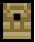
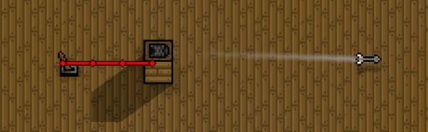
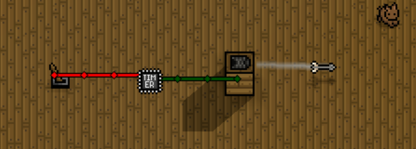
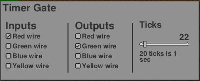

# 电路
**电路**可以用电线连接在一起，形成自动化或交互式自由创作。**你的设计无疑是时代进步的动力** 

## 电路概述
1. 通常，纯粹的布线特定项目（例如电线和门）是不可见的。然而，持有某些接线物品，例如[扳手]()、[切割机]()、[逻辑门](#逻辑门类)、[开关](#开关类)和[陷阱](#陷阱类)，将使这些不可见的物品变得可见，从而允许玩家与它们互动。 
2. 将布线物品带入洞穴中可以让玩家发现游戏生成的可能连接到陷阱和 TNT 的电线。 
3. 电线颜色有四种：红、绿、蓝、黄。 
4. 要放置电线，请按住扳手并单击左键。要移除电线，请按住切割机并单击左键。按住任一工具时，都会出现一个界面框，允许玩家选择要放置或删除的颜色。玩家可以一次放置/移除多种颜色。 
5. 按住[扳手]()，右键单击门以编辑其属性。 
6. 除此之外，选择如何解释连接到门的不同颜色的电线。例如，对于与门，选择哪些颜色是输入以及哪些颜色是输出。 
7. 握住[切割机]()，右键单击门将其移除。 
8. 电线可连接到其上方的任何接线项目。一条电线还连接到所有相邻的相同颜色的电线。 
9. 游戏会自动绘制这些连接作为视觉辅助，但玩家只能直接与电线本身进行交互。电线不与不同颜色的电线连接。一组连接的电线要么亮，要么灭。通常它会关闭，除非它连接到导致它打开的接线项目（如门输出）。 
10. 一些布线物品（例如陷阱）无法制作（除非安装相关mod），必须在洞穴中找到。 

## 电路物品
### 开关类
 深雪石材压力板 &emsp;  深层石材压力板 &emsp;  深沼石材压力板 &emsp;  地牢压力板 &emsp;  石质拉杆 &emsp;  砂岩压力板 &emsp;  雪岩压力板 &emsp;  石质压力板 &emsp;  沼泽岩石压力板 &emsp;  木制压力板   

### 逻辑门类
 与门 &emsp;  缓冲器 &emsp;  计数器 &emsp;  延迟器 &emsp;  与非门 &emsp;  或非门 &emsp;  或门 &emsp;  SR锁存器 &emsp;  传感器 &emsp;  音乐传感器 &emsp;  T触发器 &emsp;  计时器 &emsp;  异或门  

### 陷阱类
 深层沙石弓箭陷阱 &emsp;  深层沙石火焰陷阱 &emsp;  深层雪地弓箭陷阱 &emsp;  深层雪地火焰陷阱 &emsp;  深层岩石弓箭陷阱 &emsp;  深层岩石火焰陷阱 &emsp;  深层沼泽弓箭陷阱 &emsp;  深层沼泽火焰陷阱 &emsp;  地牢弓箭陷阱 &emsp;  地牢火焰陷阱 &emsp;  地牢虚空陷阱 &emsp;  冰箭陷阱 &emsp;  黑曜石弓箭陷阱 &emsp;  黑曜石火焰陷阱 &emsp;  沙石弓箭陷阱 &emsp;  沙石火焰陷阱 &emsp;  雪地岩石弓箭陷阱 &emsp;  石箭陷阱 &emsp;  石头火焰陷阱 &emsp;  沼泽岩石弓箭陷阱 &emsp;  沼泽岩石火焰陷阱 &emsp;  木箭陷阱 

### 照明类
 火焰圣杯 &emsp;  金灯 &emsp;  铁灯 &emsp;  壁式火把 &emsp;  火把

### 电路显示器
 烟花发射器 &emsp;  LED面板 

### 门
 砖门 &emsp;  深层沙石门 &emsp;  深层雪石门 &emsp;  深层岩石门 &emsp;  深层沼石门 &emsp;  地牢门 &emsp;  冰门 &emsp;  黑曜石门 &emsp;  棕榈门 &emsp;  松木门 &emsp;  沙石门 &emsp;  石门 &emsp;  沼泽岩石门 &emsp;  木门 

### 栅栏类
 铁栅栏门 &emsp;  石栅栏门 &emsp;  木栅栏门 

## 使用示例
### 触发弓箭陷阱的简单电路
这是一个将拉杆连接到木箭陷阱的简单示例。 
 
1. 将控制杆从“关闭”切换到“打开”将激活箭头陷阱，发射一支箭。 
2. 陷阱的激活速度不会超过一定的冷却时间。因此，快速打开和关闭控制杆不会比这个冷却时间更快地激活陷阱。 
3. 陷阱会向玩家放置陷阱时所面对的方向发射。 

### 带有计时器的弓箭陷阱
在此示例中，通过计时器门使陷阱重复发射箭头。 
 
1. 杠杆启动计时器。只要计时器处于活动状态，就会反复导致陷阱发射箭。 
2. 以下是本例中计时器的设置。按住扳手并右键单击计时器门来编辑/查看计时器设置。 
 
1. 红线激活定时器；绿线激活箭头陷阱。 
2. 每 22 个周期，计时器就会发出脉冲输出，导致箭头陷阱发射一支箭。 
3. 目前，陷阱的冷却时间为 20 个刻度，因此将计时器刻度减少到 20 以下不会导致箭陷阱的发射速度更快。 
4. 将计时器刻度设置为 20 将导致某些计时器脉冲不会导致陷阱触发。这是因为计时器的滴答声太接近陷阱的冷却时间。 
5. 因此，将计时器刻度设置为稍高（本例中为 22）将确保每个计时器脉冲都会导致箭头发射，这可能在视觉上更好一点。 
   
### 杀戮迷宫
[杀戮迷宫](Raiders.md#杀戮迷宫)面对入侵时普通的电路示例。 
