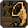
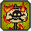

# 成就
完成以下每项任务即可获得成就哦。

| 成就图标 | 成就名称 | 获得途径 |
|---------|-------|-----------------|
||能工巧匠|通过法师为物品附魔|
||九霄云外|让一位居民获得 100% 的幸福度|
||冒险伴侣|获得第一只宠物|
||完美收藏家|获取所有可获得的物品|
||完美东家|让所有职业的居民都居住在同一个营地|
||自给自足|建立一个属于自己的营地|
||一石二鸟|一次抛竿钓上来两条鱼|
||万事开头难|击败你的第一个Boss|
||热起来了|到达深层洞穴|
||掘墓人|找到并挖起一块墓碑|
||猎头|招募你的第一位居民|
||囤囤鼠|拥有一个装满不同物品的箱子|
||倒头就睡|改变的出生点|
||魔力果实|增加饰品槽上限|
||爱好之上|钓上来五百个物品|
||马拉松选手|亲自跑完整场马拉松|
||我的音乐聚会|在音乐播放器上听磁带音乐|
||一击必中|一击秒杀一个僵尸|
||复赛|击败堕落法师|
||自我加冕|戴上一个金皇冠|
||洞穴探险爱好者|注意不要在洞穴中迷路！|
||浪费时间|在游戏内游玩超过二十四小时|
||拿下！|在三十秒内击败一个Boss|
||旅行者|拜访所有不同的生物群落|
||村庄小帮手|完成一个营地系列任务|
||冲上岸边|击败海盗船长|
||瞧我的！|装备你的首个技能饰品|
