# 洞穴
游戏中有两种类型的地下生物群落：[洞穴](Caves.md)和[深层洞穴](DeepCaves)。地下第一层是洞穴，可以通过将[梯子](../items/Ladder_Down.md)放置在任何生物群落的[地形](Terrian.md)上来交互到达。[玩家](Players.md)还可以通过[村庄](Villages.md)的入口进入洞穴，因为每个非敌对村庄都有一个通往洞穴的房间。参观洞穴是进步的起始方法之一。在这里，玩家将与怪物战斗，收集各种类型的[石头](../items/Stones.md)、[矿石](../items/Ores.md)和[矿物](../items/Minerals.md)并获得宝贵的战利品。[Boss](Bosses.md)可以使用[召唤物](../items/Boss_Items.md)在洞穴中生成。所有洞穴都可以生成[穴居动物]()；小怪物会逃离你，但如果你能够追到它们，它们就会掉落矿石和矿物。地下第二层是深层洞穴，可以通过在地形上放置[深层梯子](../items/Deeper_Ladder_Down.md)来进入。深层梯子是[海盗船长](Pirate_Captain.md)的掉落物，在击败海盗船长后可以在[高级工作站](../items/Advanced_Workstation.md)制作。  

## 森林生物群落
### 森林洞穴

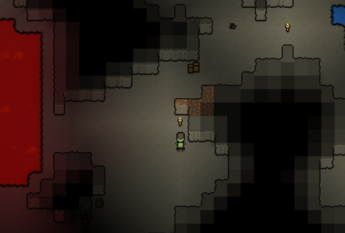  

森林洞穴位于森林生物群落下方。这是难度最低的地下区域之一。最近的位置是[长老]()房子侧室中的梯子，靠近玩家开始的地方。由于难度较低，建议新玩家从这里开始。 
这里将会遇到的[怪物](Monsters.md)包括[僵尸]()、[僵尸弓箭手]()、[爬行僵尸]()、[哥布林]()、[吸血鬼]()、[洞穴鼹鼠]()和[巨型洞穴蜘蛛]()。 
你可以在森林洞穴中掠夺以下物品：

|
种类
|
物品
|
|----------|------------|
|
[材料](Materials.md)
|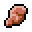 铜矿 &emsp;  铁矿 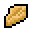 金矿 &emsp; 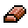 铜锭 &emsp;  铁锭 &emsp; 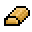 金锭 &emsp; 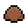 粘土 &emsp; 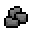 石头 &emsp;  蝙蝠翅膀 &emsp;  洞穴蜘蛛腺体 &emsp; 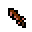 损坏的铜器 &emsp;  损坏的铁器|
|
[装备](Equipment.md)
|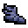 微风靴 &emsp;  贵族马掌 &emsp;  闪耀腰带 &emsp; 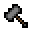 沉重之锤 &emsp; 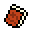 鲜血迸发 &emsp;  吸血鬼的馈赠 &emsp; 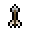 石箭 &emsp; 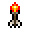 焰火箭 &emsp; 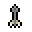 铁箭 &emsp;  忍者飞镖 &emsp; 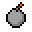 铁质炸弹 &emsp;  炸药|
|
[消耗品](Consumables.md)
|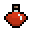 生命药水 &emsp;  生命恢复药水 &emsp;  速度药水 &emsp; 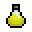 攻速药水 &emsp;  荆棘药水 &emsp; 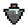 铁皮药水 &emsp; 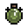 迅捷药水 &emsp; 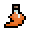 防火药水 &emsp; 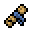 回城卷轴 &emsp; 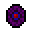 神秘传送门|
|
其他物品
|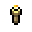 火把 &emsp; 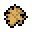 地图碎片 &emsp; 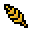 小麦 &emsp;  小麦种子 &emsp; 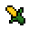 玉米 &emsp;  玉米种子 &emsp; 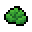 卷心菜 &emsp; 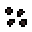 卷心菜种子 &emsp;  西红柿 &emsp; 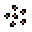 西红柿种子 &emsp; .png) WaterFae Vinyl (Surface) &emsp; .png) Muses Vinyl (Surface Night) &emsp; .png) Running Vinyl (Cave)|

### 深层森林洞穴

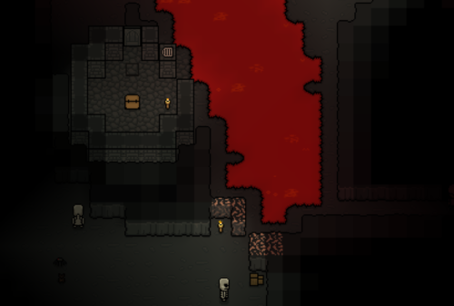

深层森林洞穴形成了森林生物群落的第二个地下层。 这里可发现的怪物包括[骷髅]()、[投手骷髅]()、[矿工骷髅]()和[深层洞穴之灵]()。玩家应该警惕深层洞穴之灵，因为这种怪物可以穿墙。 
你可以在深层森林洞穴中掠夺以下物品：

|
种类
|
物品
|
|----------|------------|
|
[材料](Materials.md)
| 铜矿 &emsp;  铁矿  金矿 &emsp; 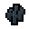 钨矿石 &emsp;  铜锭 &emsp;  铁锭 &emsp;  金锭 &emsp;  钨锭 &emsp;  生命石英 &emsp; 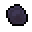 黑曜石 &emsp; 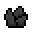 深层岩石 &emsp; 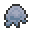 流质 &emsp; 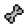 骨头|
|
[装备](Equipment.md)
|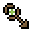 古老法杖 &emsp; 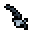 深水捕集器 &emsp; 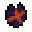 火焰之石 &emsp;  焰火箭 &emsp;  铁箭 &emsp; 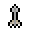 骨箭 &emsp;  铁质炸弹 &emsp;  炸药|
|
[消耗品](Consumables.md)
| 高级生命药水 &emsp;  攻速药水 &emsp;  荆棘药水 &emsp;  铁皮药水 &emsp;  迅捷药水 &emsp;  战斗药水 &emsp; 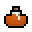 宝藏药水 &emsp;  召唤物药水 &emsp;  回城卷轴 &emsp; 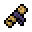 旅行卷轴 &emsp;  暗影之门|
|
其他物品
| 火把 &emsp; 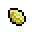 柠檬 &emsp;  柠檬树苗 &emsp; 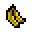 香蕉 &emsp; 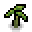 香蕉树苗 &emsp; 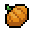 南瓜 &emsp;  南瓜种子 &emsp;  洋葱 &emsp;  洋葱种子 &emsp; 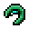 野生洞穴辉光 &emsp; 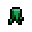 洞穴辉光萌芽 &emsp; .png) WaterFae Vinyl (Surface) &emsp; .png) Muses Vinyl (Surface Night) &emsp; .png) GrindTheAlarms Vinyl (Deep Cave)|

## 雪地生物群落
### 雪地洞穴

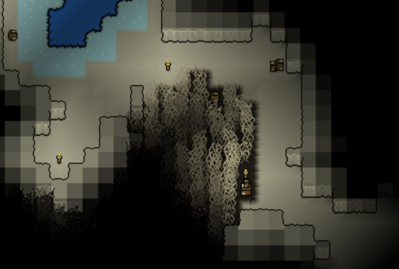

雪地洞穴位于雪原生物群落下。 这里可发现的怪物包括[僵尸]()、[弓箭手僵尸]()、[爬行僵尸]()、[陷阱僵尸]()、[冰冻矮人]()、[哥布林]()、[吸血鬼]()、[洞穴鼹鼠]()和[巨型洞穴蜘蛛]()。玩家应该小心，不要击中蜘蛛巢迷你生物群落中的[皇家之蛋]()，因为它会生成[蜘蛛女王]()。 
您可以在雪地洞穴中掠夺以下物品：

|
种类
|
物品
|
|----------|------------|
|
[材料](Materials.md)
| 铜矿 &emsp;  铁矿  金矿 &emsp;  铜锭 &emsp;  铁锭 &emsp;  金锭 &emsp; 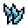 冰霜碎片 &emsp;  石头 &emsp;  雪地岩石 &emsp;  蝙蝠翅膀 &emsp;  洞穴蜘蛛腺体 &emsp;  损坏的铜器 &emsp;  损坏的铁器|
|
[装备](Equipment.md)
| 鲜血迸发 &emsp; 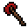 魔法枝桠 &emsp;  吸血鬼的馈赠 &emsp;  宁静玫瑰 &emsp;  冰冻之心 &emsp;  冰冻之波 &emsp;  捕手帽 &emsp;  石箭 &emsp;  焰火箭 &emsp;  铁箭 &emsp;  简易子弹 &emsp;  忍者飞镖 &emsp;  冰标枪 &emsp;  铁质炸弹 &emsp;  炸药|
|
[消耗品](Consumables.md)
| 生命药水 &emsp;  生命恢复药水 &emsp;  速度药水 &emsp;  攻速药水 &emsp;  荆棘药水 &emsp;  铁皮药水 &emsp;  迅捷药水 &emsp;  防火药水 &emsp;  击退药水 &emsp;  战斗药水 &emsp;  钓鱼药水 &emsp;  回城卷轴 &emsp;  皇室之蛋|
|
其他物品
| 火把 &emsp;  地图碎片 &emsp;  卷心菜 &emsp;  卷心菜种子 &emsp;  西红柿 &emsp;  西红柿种子 &emsp;  辣椒 &emsp;  辣椒种子 &emsp;  糖 &emsp;  甜菜 &emsp; .png) HomeAtLast Vinyl (Snow Surface) &emsp; .png) IcyRuse Vinyl (Snow Cave)|

### 深层雪地洞穴

深层雪地洞穴形成了雪原生物群落的第二个地下层。 这里发现的怪物包括[骷髅]()、[骷髅投掷者]()、[雪狼]()、[忍者]()和[冰之花]()。玩家应该警惕冰之花，因为这种怪物可以穿过墙壁。 
您可以在雪深洞穴中掠夺以下物品：

|
种类
|
物品
|
|----------|------------|
|
[材料](Materials.md)
| 铜矿 &emsp;  铁矿  金矿 &emsp;  钨矿石 &emsp;  冰川矿石 &emsp;  铜锭 &emsp;  铁锭 &emsp;  金锭 &emsp;  钨锭 &emsp;  冰川锭 &emsp;  生命石英 &emsp;  黑曜石 &emsp;  深层雪地岩石 &emsp;  冰川残片 &emsp;  骨头|
|
[装备](Equipment.md)
| 钉靴 &emsp;  寒冰之石 &emsp;  忍者兜帽 &emsp;  忍者袍 &emsp;  忍者鞋 &emsp;  冰镐 &emsp;  石箭 &emsp;  焰火箭 &emsp;  铁箭 &emsp;  骨箭 &emsp;  铁质炸弹 &emsp;  炸药|
|
[消耗品](Consumables.md)
| 生命药水 &emsp;  高级生命药水 &emsp;  攻速药水 &emsp;  荆棘药水 &emsp;  铁皮药水 &emsp;  迅捷药水 &emsp;  战斗药水 &emsp;  宝藏药水 &emsp;  防火药水 &emsp;  钓鱼药水 &emsp;  洞穴探险药水 &emsp;  回城卷轴 &emsp;  旅行卷轴 &emsp;  寒冰皇冠|
|
其他物品
| 火把 &emsp;  柠檬 &emsp;  柠檬树苗 &emsp;  香蕉 &emsp;  香蕉树苗 &emsp;  南瓜 &emsp;  南瓜种子 &emsp;  草莓 &emsp;  草莓种子 &emsp; .png) HomeAtLast Vinyl (Snow Surface) &emsp; .png) TellTale Vinyl (Snow Night) &emsp; .png) IceStar Vinyl (Deep Snow Cave)|

## 沼泽生物群落
### 沼泽洞穴

沼泽洞穴位于沼泽生物群落下。 这里发现的怪物包括[僵尸]()、[僵尸弓箭手]()、[爬行僵尸]()、[沼泽僵尸]()、[哥布林]()、[吸血鬼]()、[洞穴鼹鼠]()、[沼泽史莱姆]()、[沼泽射手]()和[巨型洞穴蜘蛛]()。 您可以在沼泽洞穴中掠夺以下物品：

|
种类
|
物品
|
|----------|------------|
|
[材料](Materials.md)
| 铜矿 &emsp;  铁矿  金矿 &emsp;  常春藤矿石 &emsp;  铜锭 &emsp;  铁锭 &emsp;  金锭 &emsp;  常春藤锭 &emsp;  沼泽岩石 &emsp;  蝙蝠翅膀 &emsp;  沼泽淤泥 &emsp;  洞穴蜘蛛腺体 &emsp;  损坏的铜器 &emsp;  损坏的铁器|
|
[装备](Equipment.md)
| 沼泽之典 &emsp;  史莱姆罐 &emsp;  植物钓竿 &emsp;  沼泽虫鱼饵 &emsp;  石箭 &emsp;  焰火箭 &emsp;  铁箭 &emsp;  忍者飞镖 &emsp;  铁质炸弹 &emsp;  炸药|
|
[消耗品](Consumables.md)
| 恶臭魔瓶 &emsp;  生命药水 &emsp;  生命恢复药水 &emsp;  速度药水 &emsp;  攻速药水 &emsp;  荆棘药水 &emsp;  铁皮药水 &emsp;  迅捷药水 &emsp;  防火药水 &emsp;  击退药水 &emsp;  战斗药水 &emsp;  钓鱼药水 &emsp;  回城卷轴 &emsp;  尖锐化石|
|
其他物品
| 火把 &emsp; 辣椒 &emsp;  辣椒种子 &emsp;  糖 &emsp;  甜菜 &emsp;  土豆 &emsp;  土豆种子 &emsp;  茄子 &emsp;  茄子种子 &emsp;  蘑菇 &emsp;  香蒲 &emsp;  沼泽草草籽 &emsp; .png) EyesOfTheDesert Vinyl (Swamp Surface) &emsp; .png) SilverLake Vinyl (Swamp Cave) &emsp;  Swamp Eel|

### 深层沼泽洞穴

深层沼泽洞穴形成了沼泽生物群落的第二个地下层。 这里发现的怪物包括[骷髅]()、[骷髅投掷者]()、[远古骷髅]()、[巨型沼泽史莱姆]()、[沼泽居民]()、[沼泽骷髅]()和[小型沼泽洞穴蜘蛛]()。 你可以在沼泽深处的洞穴中掠夺以下物品：

|
种类
|
物品
|
|----------|------------|
|
[材料](Materials.md)
| 铜矿 &emsp;  铁矿  金矿 &emsp;  钨矿石 &emsp;  菌丝矿石 &emsp;  铜锭 &emsp;  铁锭 &emsp;  金锭 &emsp;  钨锭 &emsp;  菌丝锭 &emsp;  生命石英 &emsp;  黑曜石 &emsp;  深层沼泽岩石 &emsp;  丝绸 &emsp;  洞穴蜘蛛腺体 &emsp;  骨头|
|
[装备](Equipment.md)
| 沼泽管理权杖 &emsp;  冠军徽章 &emsp;  德鲁伊弓 &emsp;  深水捕集器 &emsp;  火焰之石 &emsp;  焰火箭 &emsp;  铁箭 &emsp;  骨箭 &emsp;  铁质炸弹 &emsp;  炸药|
|
[消耗品](Consumables.md)
| 高级生命药水 &emsp;  攻速药水 &emsp;  荆棘药水 &emsp;  铁皮药水 &emsp;  迅捷药水 &emsp;  战斗药水 &emsp;  宝藏药水 &emsp;  防火药水 &emsp;  钓鱼药水 &emsp;  洞穴探险药水 &emsp;  回城卷轴 &emsp;  旅行卷轴 &emsp;  腐烂之叶|
|
其他物品
| 火把 &emsp;  柠檬 &emsp;  柠檬树苗 &emsp;  香蕉 &emsp;  香蕉树苗 &emsp;  南瓜 &emsp;  南瓜种子 &emsp;  洋葱 &emsp;  洋葱种子 &emsp;  野生洞穴辉光 &emsp;  洞穴辉光萌芽 &emsp; .png) WaterFae Vinyl (Surface) &emsp; .png) Muses Vinyl (Surface Night) &emsp; .png) GrindTheAlarms Vinyl (Deep Cave)|

## 沙漠生物群落
### 沙漠洞穴

沙漠洞穴位于沙漠生物群落下。 这里发现的怪物包括[木乃伊]()、[木乃伊法师]()、[洞穴鼹鼠]()和[沙之灵]()。玩家应该警惕沙之灵，因为这种怪物可以穿墙。 您可以在沙漠洞穴中掠夺以下物品：

|
种类
|
物品
|
|----------|------------|
|
[材料](Materials.md)
| 铜矿 &emsp;  铁矿  金矿 &emsp;  铜锭 &emsp;  铁锭 &emsp;  金锭 &emsp;  石英 &emsp;  沙石|
|
[装备](Equipment.md)
| 空气罐 &emsp;  仙人掌之盾 &emsp;  采矿护符 &emsp;  远古之羽 &emsp;  石箭 &emsp;  焰火箭 &emsp;  铁箭 &emsp;  忍者飞镖 &emsp;  铁质炸弹 &emsp;  炸药|
|
[消耗品](Consumables.md)
| 生命药水 &emsp;  生命恢复药水 &emsp;  速度药水 &emsp;  攻速药水 &emsp;  荆棘药水 &emsp;  铁皮药水 &emsp;  迅捷药水 &emsp;  防火药水 &emsp;  击退药水 &emsp;  战斗药水 &emsp;  钓鱼药水 &emsp;  回城卷轴 &emsp;  远古雕像|
|
其他物品
| 火把 &emsp;  地图碎片 &emsp;  土豆 &emsp;  土豆种子 &emsp;  茄子 &emsp;  茄子种子 &emsp;  胡萝卜 &emsp;  胡萝卜种子 &emsp;  大米 &emsp;  水稻种子 &emsp; .png) ByTheField Vinyl (Desert Surface) &emsp; .png) SunStones Vinyl (Desert Night) &emsp; .png) CaravanTusks Vinyl (Desert Cave)|

### 深层沙漠洞穴

深层沙漠洞穴形成了沙漠生物群落的第二个地下层。 这里发现的怪物包括[远古骷髅]()、[远古骷髅投掷者]()、[沙漠爬行者]()和[沙虫]()。玩家应该警惕[沙虫]()，因为这种怪物可以穿墙并且移动速度非常快。 你可以在沙漠深处的洞穴中掠夺以下物品：

|
种类
|
物品
|
|----------|------------|
|
[材料](Materials.md)
| 铜矿 &emsp;  铁矿  金矿 &emsp;  钨矿石 &emsp;  远古化石矿石 &emsp;  铜锭 &emsp;  铁锭 &emsp;  金锭 &emsp;  钨锭 &emsp;  远古化石锭 &emsp;  石英 &emsp; 生命石英 &emsp;  黑曜石 &emsp;  深层沙漠岩石 &emsp;  骨头|
|
[装备](Equipment.md)
| 远古步枪 &emsp;  占卜镜 &emsp;  挖掘之爪 &emsp;  石箭 &emsp;  焰火箭 &emsp;  铁箭 &emsp;  骨箭 &emsp;  铁质炸弹 &emsp;  炸药|
|
[消耗品](Consumables.md)
| 生命药水 &emsp;  高级生命药水 &emsp;  速度药水 &emsp;  攻速药水 &emsp;  荆棘药水 &emsp;  铁皮药水 &emsp;  迅捷药水 &emsp;  战斗药水 &emsp;  宝藏药水 &emsp;  防火药水 &emsp;  钓鱼药水 &emsp;  洞穴探险药水 &emsp;  回城卷轴 &emsp;  旅行卷轴 &emsp;  龙魂|
|
其他物品
| 火把 &emsp;  柠檬 &emsp;  柠檬树苗 &emsp;  香蕉 &emsp;  香蕉树苗 &emsp;  草莓 &emsp;  草莓种子 &emsp;  咖啡豆 &emsp; .png) GrindTheAlarms Vinyl (Deep Cave)|
