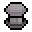
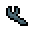
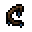

# 任务
**基本任务**是[长老]()给予的任务，以换取[任务物品]()。这些任务物品要么来自钓鱼稀有鱼，要么来自怪物和人类敌人的稀有掉落物。奖励通常是游戏中一些随机的常见物品，但也有可能奖励稀有物品。 
[Boss任务](#boss任务)是杀死Boss并返回以获得一次性奖励的一次性任务。由于玩家只能执行该任务一次，因此任务完成后即可从[旅行商人](NPCs.md#旅行商人)处购买奖励。要获得 Boss 任务，必须至少完成一个基本任务，或者自最后一个Boss被杀死后完成一个基本任务。Boss 任务不必激活即可完成。*如果玩家乱杀boss，没有任务，甚至是第一次杀boss时准备交任务，长老会默认该boss任务完成*。 
当任务处于活动状态时，屏幕左上角的任务窗口将会出现。背包管理栏中任务窗口会显示任务的对象。 
## Boss任务
### 相关任务
以下是boss结算任务。奖励仅限一次（每个营地）。
|
任务名称
|
任务奖励
|
|------|------|
|击败[恶魔守卫]()|子弹袋|
|击败[蜘蛛女王]()|午餐盒|
|击败[虚空巫师]()|虚空储物袋|
|击败[沼泽守护者]()|传送石碑和路径石碑|
|击败[远古秃鹫]()|回城魔瓶|
|击败[海盗船长]()|钱袋|
|击败[收割者]()|悬浮板|
|击败[冰雪女王]()|旗帜架|
|击败[佩斯典狱长]()|传送瓶|
|击败[圣人和砂砾]()|闪光权杖
|
|击败[堕落法师]()|虚空背包|

## 营地任务
### 相关任务
以下是基本的营地任务。奖励是随机的。
|
任务
|
任务对象
|
任务地点
|
|------|-------|------|
||
基本任务
||
|交付鲨鱼宝宝|在深水中[钓鱼]()|地表海洋|
|交付螃蟹爪子|螃蟹|[沙漠生物群落](Biomes.md#沙漠群落)地表|
|交付黄沙射线|在[沙漠生物群落](Biomes.md#沙漠群落)[钓鱼]()|[沙漠生物群落](Biomes.md#沙漠群落)|
||
[恶魔守卫]()系列
||
|交付僵尸手臂|僵尸|洞穴或者地表夜晚|
|交付哥布林戒指|哥布林|[森林洞穴](Caves.md#森林洞穴)|
|交付虚假獠牙|吸血鬼|[森林洞穴](Caves.md#森林洞穴)或者[雪地洞穴](Caves.md#雪地洞穴)|
||
[蜘蛛女王]()系列
||
|交付蜘蛛腿|黑色洞穴蜘蛛|[森林洞穴](Caves.md#森林洞穴)或者[雪地洞穴](Caves.md#雪地洞穴)|
|交付幼年剑鱼|在雪地洞穴钓鱼|[雪地洞穴](Caves.md#雪地洞穴)|
||
[虚空巫师]()系列
||
|交付魔法项圈|附魔僵尸|[地牢](Dungeon.md)|
|交付学徒卷轴|虚空学徒|[地牢](Dungeon.md)|
|交付暗黑宝石|虚空学徒|[地牢](Dungeon.md)|
|交付书（4）|地牢书架|[地牢](Dungeon.md)|
||
[沼泽守护者]()系列
||
|交付史莱姆块|沼泽史莱姆|[沼泽洞穴](Caves.md#沼泽洞穴)|
|交付沼泽鳗鱼|在沼泽洞穴钓鱼|[沼泽洞穴](Caves.md#沼泽洞穴)|
|交付史莱姆发射器|沼泽弓箭手|[沼泽洞穴](Caves.md#沼泽洞穴)|
||
[远古秃鹫]()系列
||
|交付木乃伊绷带|木乃伊|[沙漠洞穴](Caves.md#沙漠洞穴)|
|交付魔力沙子|法师木乃伊|[沙漠洞穴](Caves.md#沙漠洞穴)|
|交付洞穴牡蛎|在沙漠洞穴钓鱼|[沙漠洞穴](Caves.md#沙漠洞穴)|
|交付禁锢灵魂|沙之灵|[沙漠洞穴](Caves.md#沙漠洞穴)|
||
[海盗船长]()系列
||
|交付木制义肢|海盗新兵|[海盗村庄](Pirate_Village.md#海盗村庄)|
|交付眼罩|海盗新兵|[海盗村庄](Pirate_Village.md#海盗村庄)|
|交付朗姆酒酒瓶|海盗新兵|[海盗村庄](Pirate_Village.md#海盗村庄)|
||
[收割者]()系列
||
|交付深层灵魂拭子|深层洞穴之灵|[深层森林洞穴](Caves.md#深层森林洞穴)|
|交付断肢|骷髅|[深层森林洞穴](Caves.md#深层森林洞穴)|
||
[冰雪女王]()系列
||
|交付野生尾巴|雪狼|[深层雪地洞穴](Caves.md#深层雪地洞穴)|
|交付寒冰剃刀|冰之花|[深层雪地洞穴](Caves.md#深层雪地洞穴)|
||
[佩斯典狱长]()系列
||
|交付腐化之弓|沼泽居民|[深层沼泽洞穴](Caves.md#深层沼泽洞穴)|
|交付史莱姆样本|沼泽史莱姆|[深层沼泽洞穴](Caves.md#深层沼泽洞穴)|
||
[圣人和砂砾]()系列
||
|交付蠕虫毒牙|沙虫|[深层沙漠洞穴](Caves.md#深层沙漠洞穴)|
|交付爬虫足|沙漠爬行者|[深层沙漠洞穴](Caves.md#深层沙漠洞穴)|

## 奖励
完成每个任务后，玩家将获得以下奖励之一和 20-50 个[金币]()。

|
奖励
|
权重
|
出现概率
|
|-----|-----|------|
|3-6个[随机药水]()|2000|48.78%|
|2-5个回城卷轴|400|9.76%|
|2-5个旅行卷轴|400|9.76%|
|建筑锤|200|4.88%|
|伸缩梯|200|4.88%|
|工具扩展器|200|4.88%|
|物品吸引器|200|4.88%|
|拳击手套枪|200|4.88%|
|无限水桶|100|2.44%|
|无尽绳子|100|2.44%|
|外星人面具 外星人玩偶上衣 外星人玩偶靴|50|1.22%|
|小鸡面具 小鸡玩偶上衣 小鸡玩偶靴|50|1.22%|
|青蛙面具 青蛙玩偶上衣 青蛙玩偶靴|50|1.22%|
|小马面具 小马玩偶上衣 小马玩偶靴|50|1.22%|

*基于权重，几乎一半的时间奖励是药水。*