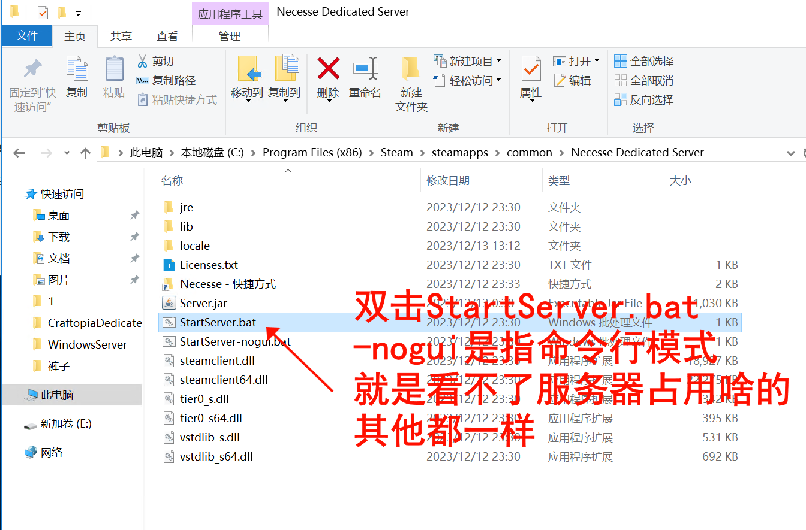
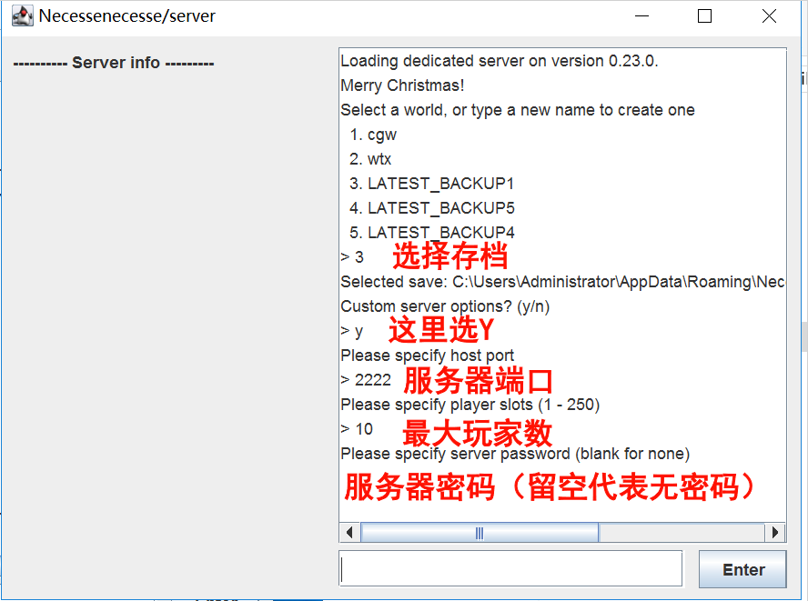

# 服务器
- [服务器](#服务器)
  - [运行要求](#运行要求)
  - [购买服务器](#购买服务器)
  - [Windows服务器](#windows服务器)
    - [下载服务器文件](#下载服务器文件)
      - [①通过下载](#通过下载)
      - [②通过Steam](#通过steam)
      - [③通过SteamCMD](#通过steamcmd)
    - [运行服务器](#运行服务器)
    - [配置服务器](#配置服务器)
    - [Windows文件位置](#windows文件位置)
  - [Docker搭建](#docker搭建)
    - [构建镜像：](#构建镜像)
    - [创建一个世界](#创建一个世界)
    - [相关命令](#相关命令)
  - [Linux服务器](#linux服务器)
    - [创建将运行服务器的用户。](#创建将运行服务器的用户)
    - [下载并解压SteamCMD](#下载并解压steamcmd)
    - [端口](#端口)
    - [Linux文件位置](#linux文件位置)


## 运行要求
CPU：2核  
内存：2G以上(站长最高记录是10G，不过那张图有特别多的牲畜)  
存储空间：大约200M  
带宽：4人每Mbps
## 购买服务器
 [雨云](https://www.rainyun.com/MTQwMTI2_) 优惠码：```MTQwMTI2```  
  [腾讯云](https://curl.qcloud.com/EvkthMqu)  
 [阿里云](https://www.aliyun.com/)
## Windows服务器
### 下载服务器文件
下载服务器文件可以通过三种不同的方式执行，它们是：

#### ①通过下载

您可以下载位于的服务器文件 [https://necessegame.com/server/](https://necessegame.com/server/)

#### ②通过Steam

导航至您的 Steam 库并筛选工具  


选择“Necesse Dedicated Server”；然后点击安装  


#### ③通过SteamCMD

请参阅 Valve 的开发者 wiki，了解如何下载和安装 SteamCMD：

https://developer.valvesoftware.com/wiki/SteamCMD

安装后，双击安装文件夹中的 Steamcmd.exe 运行 SteamCMD。

在 SteamCMD 窗口中，输入以下内容：

```
login anonymous
```

要更改专用服务器的安装位置，请使用命令```force_install_dir C:\Necesse``` 这将告诉 SteamCMD 将 Necesse 专用服务器文件安装到 PC C 驱动器上名为 Necesse 的文件夹中

接下来，通过键入以下内容将服务器文件下载到指定文件夹：
```
app_update 1169370 validate
```
当该过程完成时，它会显示```"Success! App '1169370' fully installed."```然后，您可以通过输入```quit```关闭 Steam CMD：

### 运行服务器
在Steam库里右键 - 管理 - 浏览本地文件 ，进入服务器目录。  
双击StartServer.bat开启服务器  
  
### 配置服务器
这里选择存档（第一次开启会创建时间，你可以把你自己的存档放[存档目录](/guides/Server.md#windows文件位置)）  
<font color=red>端口范围在1-65525之间，建议10000以上的端口，不要用一千以内的端口。</font>  
Custom server option  选N就会按照上次运行的配置运行  
  

### Windows文件位置
默认情况下

服务器配置文件被命名为“server.cfg”。位于 ```C:\Users\%USERPROFILE%\AppData\Roaming\Necesse\cfg```

世界配置文件名为“worldSettings.cfg”。位于 ```C:\Users\%USERPROFILE%\AppData\Roaming\Necesse\saves\YourWorldNamehere.zip```

存档是根据世界名称命名的.zip，位于```C:\Users\%USERPROFILE%\AppData\Roaming\Necesse\saves\```

服务器日志位于 ```C:\Users\%USERPROFILE%\AppData\Roaming\Necesse\logs```


## Docker搭建
在空目录中创建 Dockerfile：
```
# Use a base image
FROM debian:bullseye-slim

# Add user 'necesse', don't run stuff as root!!
ARG user=necesse
ARG group=necesse
ARG uid=1000
ARG gid=1000

RUN groupadd -g ${gid} ${group}
RUN useradd -u ${uid} -g ${group} -s /bin/bash -m ${user}

RUN dpkg --add-architecture i386
RUN apt update; apt install -y ca-certificates-java
RUN apt update; apt install -y lib32gcc-s1 curl openjdk-17-jre-headless

# Download and extract SteamCMD
RUN mkdir -p /Steamapps
RUN curl -sqL https://Steamcdn-a.akamaihd.net/client/installer/Steamcmd_linux.tar.gz | tar zxvf - -C /Steamapps
WORKDIR /Steamapps

# Create the update_necesse.txt file
RUN echo '@ShutdownOnFailedCommand 1' >> update_necesse.txt \
    && echo '@NoPromptForPassword 1' >> update_necesse.txt \
    && echo 'force_install_dir /app/' >> update_necesse.txt \
    && echo 'login anonymous' >> update_necesse.txt \
    && echo 'app_update 1169370 validate' >> update_necesse.txt \
    && echo 'quit' >> update_necesse.txt

RUN echo $(date) && ./Steamcmd.sh +runscript update_necesse.txt

# Saves will be available under /root/.config/Necesse/saves
RUN chown -R 1000:1000 /app
RUN mkdir -p /home/necesse/.config/Necesse
RUN chown -R 1000:1000 /home/necesse

USER ${uid}:${gid}

# Set the working directory and create entrypoint.sh
WORKDIR /app
RUN echo '#!/bin/sh' > entrypoint.sh && \
    echo 'java -jar Server.jar -nogui -world "$WORLD_NAME"' >> entrypoint.sh && \
    chmod +x entrypoint.sh

# Set the entry point for the container
CMD ["./entrypoint.sh"]
```
### 构建镜像：
```
docker build -t necesse .
```
### 创建一个世界
运行容器一次以创建一个世界：
```
docker run --rm -it -v necesse_data:/home/necesse.config/Necesse necesse java -jar Server.jar -nogui
```
请记住世界名！
### 相关命令
```
docker stop necesse
docker rm necesse
docker build -t necesse .
docker run -d --name necesse \
  -e WORLD_NAME=my_world\
  -p 14159:14159/udp \
  -v ./data:/home/necesse/.config/Necesse \
  --restart always \
  necesse
```
## Linux服务器
Linux 专用服务器设置说明
在基于 Debian 的发行版上设置专用服务器的说明。

我们将使用 SteamCMD 来安装和更新服务器。

使用以下命令以 root 或具有 sudo 权限的用户身份安装 SteamCMD 依赖项。

```
sudo dpkg --add-architecture i386 
sudo apt update
sudo apt install -y lib32gcc1 
sudo apt install -y lib32gcc-s1
```

### 创建将运行服务器的用户。
```
sudo useradd --create-home necesse
```

更改为必要用户并转到其主目录，我们将在其中安装 Steam 和服务器文件。

```
su - necesse ; cd /home/necesse
```
### 下载并解压SteamCMD
```
curl -sqL "https://Steamcdn-a.akamaihd.net/client/installer/Steamcmd_linux.tar.gz" | tar zxvf -
```
创建将管理 SteamCMD 的配置文件
```
cat >$HOME/update_necesse.txt <<'EOL'
@ShutdownOnFailedCommand 1 //如果更新多个服务器，则设置为 0。
@NoPromptForPassword 1
force_install_dir /home/neesse/
login anonymous // 匿名登录
app_update 1169370 validate
quit
EOL
```
运行 SteamCMD 并将其指向配置文件以安装和更新服务器。
```
./home/necesse/Steamcmd.sh +runscript $HOME/update_necesse.txt
```
这将需要几分钟的时间。 SteamCMD 将首先更新自身，然后下载服务器文件。

此命令还将更新服务器文件。可以将其作为 cron  任务运行，也可以根据需要手动运行。


您现在可以使用以下命令启动 Necesse 服务器
```
./StartServer-nogui.sh
```
每次服务器启动时，您都必须回答几个问题。

要在没有交互的情况下启动服务器，请使用 -world [保存名称] 参数。

例子：``` ./StartServer-nogui.sh -world SaveGame1```
### 端口
默认端口为：```14159```

您需要进行端口转发并找到您的 IP 地址以提供给朋友。

[联机工具与方法](/guides/Connect.md)

### Linux文件位置
默认情况下

服务器配置文件被命名为“server.cfg”。并位于```~/.config/Necesse/cfg```

世界配置文件名为“worldSettings.cfg”。并位于```~/.config/Necesse/saves/YourWorldNamehere.zip```

保存数据是根据世界名命名的.zip，位于```~/.config/Necesse/saves```

服务器日志位于```~/.config/Necesse/logs```

您还可以使用 shell 脚本文件中的 -localdir 参数将配置强制写入游戏目录。

例子： ```./StartServer-nogui.sh -localdir```
  


