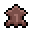

# 动物
 
**动物们**生活在地表的所有生物群落中。与[小动物](Critters.md)不同，动物不会自发生成或消失，即使被杀死也不会重生。他们中的大多数都可以用[绳子]()引导，甚至可以牵到其他岛屿。如果喂它们[小麦]()，有些可以被驯服和繁殖。 

## 家养动物
**家养动物**数量众多，可以很容易地接近并用绳子牵着，或者从[动物饲养员](NPCs.md#动物饲养员)或[旅行商人](NPCs.md#其他npc)那里购买。对野生羊或牛使用[绳子]()（鼠标右键），这样它就会跟着你。您可以同时使用多根绳子。右键单击门以使其保持打开状态。将动物引入围栏区域，然后右键对其单击将其放走。  
创建畜牧区可能是有益的。该区域将允许动物饲养员自动照顾它们。  
开始用手或通过喂食槽给他们喂小麦。饲料槽是一个可以装满小麦的容器，如果放置在围栏区域内，可以给动物喂食。  
喂食的动物在长时间进食后会变得驯服。您可以将光标悬停在动物上以查看驯服过程已经进行了多长时间。*注意，饥饿的动物会慢慢失去驯服状态。*  
当动物达到100%驯服时，它就可以开始进入爱情模式。  
如果它们在被驯服时被喂食小麦，它们就可以进入爱情模式，如果两个相同的生物彼此靠近，就会产生一只它们的孩子。而它们的孩子需要32分钟才能长大成成年动物。  
如果动物太拥挤（8 格内有 10 只动物被视为“拥挤”），或者已经输入繁殖间隔（24 分钟），动物将不再进入爱情模式。您还可以通过左键单击突出显示的区域来设置饲养区域中饲养的动物的最大数量。多余的动物将被动物饲养员宰杀。 

|
家养动物
|
分布区域
|
掉落物
|
生产速率
|
生产所需工具
|
|------|------|------|------|------|
|牛|[森林生物群落](Biomes.md#森林群落)和[沼泽生物群落](Biomes.md#沼泽群落)|生牛肉 &emsp; 皮革|牛奶 每天|铁桶|
|羊|[森林生物群落](Biomes.md#森林群落),[雪地生物群落](Biomes.md#雪地群落)和[沼泽生物群落](Biomes.md#沼泽群落)|生羊肉 &emsp; 羊毛|羊毛 每20-30分钟|剪刀|
|猪|无法生成，需要用[进口猪]()|猪肉|只增肥|只增肥|

## 可驯化动物
**可驯化动物**不如家养动物常见。像家养动物一样，它们不会逃离玩家，可以用绳子和栅栏围起来，但它们不会繁殖，也不会吃食物。目前，养着企鹅只能当花瓶。然而，鸵鸟是可以骑的。它本质上是一艘陆地船。 

|
家养动物
|
分布区域
|
掉落物
|
|------|------|------|
|鸵鸟|[沙漠生物群落](Biomes.md#沙漠群落)|低级羽毛|
|企鹅|[雪地生物群落](Biomes.md#雪地群落)|潮湿垂冰|

## 野生动物
**野生动物**不能被绳索束缚和驯服。它们没有敌意，但如果受到攻击就会变得有敌意。 

|
家养动物
|
分布区域
|
掉落物
|
|------|------|------|
|北极熊|[雪地生物群落](Biomes.md#雪地群落)|极地之爪|