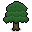

# 生物群落(Biomes)
有四种主要生物群落和十种岛屿类型。每个生物群落决定了岛屿和[洞穴](Caves.md)的外观、那里会生长哪些植物以及会生成哪些动物或怪物。参观完所有岛屿后，您将获得一项[成就](../items/Achievements.md).( *旅行者成就* )

| 
生物群落
 | 
岛屿
 |
|-------------|-------------|
|  [森林群落](##森林群落) | 森林岛屿、森林村庄、平原、海盗村庄、[地牢](Dungeon.md)入口 |
|  [雪地群落](##雪地群落) | 雪地岛屿、雪地村庄 |
|  [沼泽群落](##沼泽群落) | 沼泽岛屿 |
|  [沙漠群落](##沙漠群落) | 沙漠岛屿、沙漠村庄 |

## 森林群落
森林是主要生物群落。拥有森林生物群系的岛屿有森林岛屿、森林村庄、平原、海盗村庄和地牢入口。您可以在这里获得[云杉树苗]()、[橡树树苗]()和[蓝莓灌木丛]()，以及[向日葵]()和[火焰花]()。森林生物群落中还可以找到[牛]()、[羊]()和[兔子]()。[僵尸]()和[僵尸弓箭手]()将在夜间生成。  

### 森林群落
拥有小型遗迹的群落

  

### 平原
平原的树木比森林岛屿少。

### 森林村庄
每个森林村庄都有一个通往[森林洞穴]()的入口。

### 海盗村庄
[海盗船长]()可以在这里找到。一旦你靠近他们的村庄，[海盗新兵]()就会攻击你。如果你远离村庄，海盗就不会追你。海盗和海盗船长被击败后不会重生。

### 地牢入口
地牢入口由[吸血鬼]()或[虚空学徒]()守卫着。它们被击败后不会重生。

## 雪地群落
有两种类型的具有雪原生物群落的岛屿：雪地岛屿和雪地村庄。您可以在这里获得[松树树苗]()和[黑莓灌木丛]()，以及[寒冰花]()、[绵羊]()、[雪兔]()和[北极熊]()也可以在雪原生物群系中找到。[僵尸]()、[弓箭手僵尸]()和[陷阱僵尸]()将在夜间生成。

### 雪地岛屿
拥有小型遗迹的群落。  

  

### 雪地村庄
每个雪地村庄都有一个通往[雪地洞穴]()的入口。  

  

## 沼泽群落
只有沼泽岛屿拥有沼泽生物群系。世界中没有沼泽村庄。
你可以在沼泽岛上获得[柳树苗]()、[蘑菇]()和[香蒲]()。[羊]()、[牛]()和[沼泽史莱姆]()也可以在这里找到。[僵尸]()、[僵尸弓箭手]()和[沼泽僵尸]()在夜间生成。

### 沼泽遗迹
沼泽岛屿上没有沼泽洞穴入口。您需要制作[梯子]()才能进入[沼泽洞穴]()。

## 沙漠群落
有两种类型的具有沙漠生物群落的岛屿：沙漠岛屿和沙漠村庄。您可以在这里获得[棕榈树苗]()和[椰子树苗]()，以及[仙人掌]()。[野生鸵鸟]()也可以在沙漠生物群落中找到。[僵尸]()、[僵尸弓箭手]()和[木乃伊]()将在夜间生成。

### 沙漠岛屿
拥有小型遗迹的群落。  

  

### 沙漠村庄
每个沙漠村庄都有一个通往[沙漠洞穴]()的入口。  

  