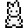

# 小动物
**小动物**是非敌对动物，它们会在地表和地下的所有生物群系中自发生成，这与不会自发生成的动物不同。大多数生物的生命值较低，并且不会被大门或栅栏阻挡。它们不能被绳子拴住，也不会掉落战利品，*部分小动物会掉落对应肉类*。小动物主要是为了给生物群落增添一种基于自然的氛围，让它们看起来更有活力。他们在被玩家造成伤害后不会攻击玩家。

## [森林生物群落](Biomes.md#森林群落)小动物

|
名称
|
掉落物
|
|----|----|
|鸭子|鸭胸肉|
|兔子|兔腿|
|鸟|无|
|松鼠|无|
|红雀|无|
|蓝鸟|无|

## [雪地生物群落](Biomes.md#雪地群落)小动物

|
名称
|
掉落物
|
|----|----|
|鸭子|鸭胸肉|
|雪兔|兔腿|
|鸟|无|
|蓝鸟|无|

## [沼泽生物群落](Biomes.md#沼泽群落)小动物

|
名称
|
掉落物
|
|----|----|
|鸭子|鸭胸肉|
|青蛙|蛙腿|
|红雀|无|
|沼泽蛞蝓|无|
|鸟|无|

## [沙漠生物群落](Biomes.md#沙漠群落)小动物

|
名称
|
掉落物
|
|----|----|
|鸭子|鸭胸肉|
|螃蟹|螃蟹爪子|
|金丝雀|无|
|乌龟|无|
|蝎子|无|

## [洞穴生物群落](Caves.md)小动物

|
名称
|
掉落物
|
|----|----|
|老鼠|无|
|蜘蛛|无|
|穴居人|取决于穴居人生物的生物群落对应[矿石]()|
