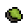
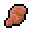
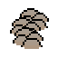
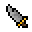
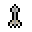
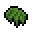
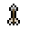

# 怪物
**怪物**是玩家在游戏中要对抗的主要生物。它们一看到玩家就会攻击并跟随玩家，直到玩家脱离攻击范围。怪物有时会掉落基本战利品，例如[金币]()、低品质[矿石]()和[火把]()，但除少数怪物外，它们通常不会掉落[装备]()。

## 怪物列表
|
怪物名称
|
血量
|
护甲
|
攻击力
|
掉落物
|
|-------|----------|---------|--------|----------|
|上古装甲骷髅|350|25|40|骨头(1-3)|
|上古骷髅|300|25|40|骨头(1-3)|
|上古骷髅法师|175|25|50|骨头(1-3)|
|上古投掷骷髅|175|25|40|骨头(1-3)|
|洞穴蜘蛛|250|10|35|洞穴蜘蛛腺体(1-2)|
|洞穴鼹鼠|75|0|40|无|
|爬行僵尸|100|0|40|铜矿（1-3） 15% 铁矿（1-3） 15% 损坏的铜器 5% 损坏的铁器 5% 地图碎片 5% |
|冰之花|150|20|35|冰川残片（1-2）|
|深层洞穴之灵||||流质（1-2）|
|沙漠爬行者|150|20|35|无|
|附魔爬行僵尸|250|20|45|地图碎片 5%|
|附魔僵尸|120|10|40|地图碎片 5%|
|附魔弓箭手僵尸|150|10|30|地图碎片 5%|
|冰霜哨兵|80|10|30|地图碎片 5% 冰霜碎片（1-2）|
|冰冻矮人|100|5|0|冰标枪（10-15）|
|洞穴巨蛛|200|5|30|洞穴蜘蛛腺体(1-2)|
|沼泽史莱姆|400|25|50|无|
|哥布林|50|0|30|铜矿（1-3） 15% 铁矿（1-3） 15% 损坏的铜器 5% 损坏的铁器 5% 地图碎片 5% 金币 （5-15）|
|胡狼|125|10|40|无|
|木乃伊|175|10|35|地图碎片 5%|
|法师木乃伊|150|10|35|地图碎片 5%|
|海盗鹦鹉|50|20|60|海盗弯刀 2.5% 左轮手枪 2.5% 简易子弹（40-80） 2.5% 金币（10-50）|
|沙之灵|100|10|30|无|
|沙虫|1000|15|？|？？？|
|骷髅|250|20|40|骨头(1-3)|
|骷髅矿工|300|20|40|骨头(1-3) 铁矿（2-6） 20% 铁锭（1-4） 20% 钨矿（2-6） 20% 钨锭（1-4） 20% 黑曜石（2-5） 20%|
|投手骷髅|150|20|40|骨头(1-3)|
|小型沼泽洞穴蜘蛛|350|25|50|洞穴蜘蛛腺体(1-2) 丝绸（1-2）|
|雪狼|250|20|45|无|
|沼泽洞穴蜘蛛|300|10|35|洞穴蜘蛛腺体(1-2)|
|沼泽居民|350|25|35|骨箭（2-6）|
|沼泽弓箭手|200|10|0|地图碎片 5% 沼泽淤泥 50%|
|沼泽骷髅|350|25|40|骨头(1-3)|
|沼泽史莱姆|200|0|25|地图碎片 5%|
|沼泽僵尸|150|10|35|铜矿（1-3） 15% 铁矿（1-3） 15% 损坏的铜器 5% 损坏的铁器 5% 地图碎片 5% 沼泽淤泥 50%|
|猎手僵尸|120|0|30|铜矿（1-3） 15% 铁矿（1-3） 15% 损坏的铜器 5% 损坏的铁器 5% 地图碎片 5% 捕手帽 5%|
|吸血鬼|75|0|60|蝙蝠翅膀（1-3） 地图碎片 5%|
|虚空学徒|125|10|40|虚空残片（0-2）|
|僵尸|100|0|25|铜矿（1-3） 15% 铁矿（1-3） 15% 损坏的铜器 5% 损坏的铁器 5% 地图碎片 5% 神秘传送门 2%|
|弓箭手僵尸|50|0|25|石箭（2-6） 铜矿（1-3） 15% 铁矿（1-3） 15% 损坏的铜器 5% 损坏的铁器 5% 地图碎片 5% 神秘传送门 2%|
