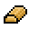
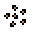
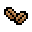
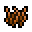

# NPC
玩家可以在[村庄](Villages.md)、[地牢]()和[洞穴](Caves.md)中探索世界时找到NPC。NPC偶尔也会到达玩家的营地。 玩家可以与一些NPC进行[交易]()，以赚取[金币]()并购买必要的[装备]()。此外，大多数NPC都可以用NPC喜欢的金币和物品来雇佣，成为玩家[营地](Settlements.md)中的居民。有些NPC只有在满足某些条件后才能招募，例如击败特定[Boss]()。 NPC的健康状况取决于您在[长老任务]()中的进度。其他统计数据的改进取决于居民所佩戴的装备。 
## 可以加入营地的NPC
所有定居者都会从事拖运、手工艺、林业和农业，除了[守卫](#守卫)只能做拖运，而[长老](#长老)则不能做任何事情。一些定居者还可以执行特殊任务： 
 • [农夫](#农夫)可使用施肥在规定的施肥区给田地施肥  
 • [猎人](#猎人)可以狩猎小动物  
 • [动物饲养员](#动物饲养员)可以从事畜牧业，照顾您的牛和羊  
 • [法师](#法师)可以为饰品、武器、盔甲和一些工具附魔  
 • [渔夫](#渔夫)可以被派去钓鱼旅行  
 • [探险家](#探险家)可以被派去发现新的岛屿和探索洞穴  
 • [造型师](#造型师)可以改变你的外表  
 • [矿工](#矿工)可以被派去采矿之旅  
 房间越大、家具越多、食物越好，居民就会越高兴。快乐的居民可以享受更好的商店价格，并且休息时间更少、更短。[法师](#法师)、[渔夫](#渔夫)、[探险家](#探险家)和[造型师](#造型师)的特殊服务需要[金币]()兑换。

|
外貌
|
名字
|
工作
|
招募需求
|
|------|--------|--------|-------|
||[长老](#长老)|我年纪大了，嘿嘿|自动地在游戏初期出现|
||[村民](#村民)|搬运、制造、林业、种植|无|
||[猎人](#猎人)|搬运、制造、林业、种植和**打猎**|如果从另一个村庄招募，需要打败[远古秃鹫]()；否则无硬性要求|
||[炼金术师](#炼金术师)|搬运、制造、林业、种植|无|
||[渔夫](#渔夫)|搬运、制造、林业、种植和**钓鱼**|无|
||[铁匠](#铁匠)|搬运、制造、林业、种植|无|
||[农夫](#农夫)|搬运、制造、林业、种植和**施肥**|无|
||[守卫](#守卫)|只能搬运|无|
||[军火商](#军火商)|搬运、制造、林业、种植|无|
||[典当商](#典当商)|搬运、制造、林业、种植|击败[海盗船长]()or拥有八个或更多居民|
||[动物饲养员](#动物饲养员)|搬运、制造、林业、种植和**畜牧**|击败[虚空巫师]()|
||[探险家](#探险家)|搬运、制造、林业、种植|击败[虚空巫师]()|
||[矿工](#矿工)|搬运、制造、林业、种植|击败[恶魔守卫]()or一个[穴居者]()有几率出现|
||[法师](#法师)|搬运、制造、林业、种植|击败[虚空巫师]()|
||[失落海盗](#失落海盗)|搬运、制造、林业、种植|击败[海盗船长]()|
||[造型师](#造型师)|搬运、制造、林业、种植|击败[海盗船长]()后在附近营救|

 小贴士： 
1. 探险家可以在[沙漠洞穴](Caves.md#沙漠洞穴)中招募 
2. 法师可以在[地牢](Dungeon.md)中被营救，然后再击败[虚空巫师]() 
3. 造型师可以在[海盗村庄](Pirate_Village.md)中被营救，然后再击败[海盗船长]() 

## 其他NPC

|
外貌
|
名字
|
工作
|
|------|--------|--------|
||旅行商人|贩卖|

## NPC死亡

如果居民在[掠袭事件]或怪物攻击中死亡，他们不会重生（[长老]()除外），但相同类型的居民很有可能在被招募后不久到达。 
**注意**，召唤时生成的Boss（例如[恶魔守卫]()或[远古秃鹫]()）也可以杀死居民，请小心不要将它们召唤到距离您的[营地]()太近的地方。

### 长老

**长老**是游戏开始时默认可用的[居民](#npc)。如果在创建世界时选择了相应的选项，玩家将在他的房子附近生成。 
玩家可以使用长老的房子作为自己的房子，以及[工作站]()和[宝箱]()中的所有物品。在房子里，玩家还可以找到一个小房间，里面有通往[洞穴](Caves.md)的[梯子]()。 
长老为玩家提供报酬丰厚的[任务]()。他是唯一一个被杀后会重生的居民。 
长老有 10% 的几率生成具有特殊名字的人，表现出持续的贡献。它将从以下选项之一中进行选择：Diligo、Haydex、Kamikaze、Subject、Vireyar、Fair。 
长老不能执行任何工作。 

掉落物： 长老的帽子

#### 长老的房子

### 村民

**村民**是一种通用 NPC，可以在任何村庄中找到。 
村民的招募要求最低，因此可以在游戏早期就被雇用。 
村民可以从事搬运、制造、林业和种植任务。

### 猎人

**猎人**可以在[村庄](Villages.md)和非村庄岛屿上找到。他出售远程[武器]()和[弹药]()。他将从玩家那里购买[羊毛]()和[皮革]()。 
当从村庄招募时，你需要击败[远古秃鹫]()才能做到这一点。 
猎人是唯一从事狩猎工作的居民。他还可以从事搬运、制造、林业和农业任务。 

玩家可向猎人出售：

|
名字
|
价格
|
频率
|
|----|----|-----|
|羊毛|？- ？|总是|
|皮革|？- ？|总是|

#### 商店

|
名字
|
价格
|
频率
|
|----|----|----|
|焰火箭|？- ？|总是|
|石箭|？- ？|总是|
|忍者飞镖|20-30|总是|
|铁箭|？- ？|总是|
|冰标枪|30-40|击败[恶魔守卫]()|
|铁弓|70-100|总是|
|魔法箭袋|600-1000|击败[远古秃鹫]()|

### 炼金术师

炼金术师可以在村庄中找到。 
他出售[药剂]()和[烟花火箭]()（[烟花]()）。他将从玩家那里购买某些[鲜花]()。炼金术师可以完成搬运、制造、林业和种植工作。 

玩家可向猎人出售：

|
名字
|
价格
|
频率
|
|----|----|-----|
|向日葵|？- ？|总是|
|火焰花|？- ？|总是|
|寒冰花|？- ？|总是|
|洞穴辉光|？- ？|总是|

#### 商店

|
名字
|
价格
|
频率
|
|----|----|----|
||8-12|总是|
||10-26|总是|
||25-35|总是|
||25-35|总是|
||25-35|总是|

### 渔夫

**渔夫**可以在村庄中找到。他会售卖[鱼饵]()。 
钓鱼者将从玩家那里购买[戈布鱼]()、[半鱼]()、[毛皮之鱼]()、[冰霜之鱼]()、[沼泽之鱼]()、[岩鱼]()和[恐惧之鱼]()。 
入住后，他可以被派去钓鱼。一旦被派去钓鱼，渔夫将离开定居点一小段时间，并带着所选的鱼回来。 
**渔夫**是唯一从事捕鱼工作的居民。他还可以从事搬运、制作、林业和种植工作。 
**渔夫**可以通过交付[金币]()、[戈布鱼]()、[半鱼]()、[毛皮之鱼]()、[冰霜之鱼]()、[沼泽之鱼]()后，加入您的营地。

玩家可向渔夫出售：

|
名字
|
价格
|
频率
|
|----|----|-----|
|戈布鱼|16-25|总是|
|半鱼|16-25|总是|
|毛皮之鱼|16-25|总是|
|冰霜之鱼|16-25|总是|
|沼泽之鱼|16-25|总是|
|岩鱼|16-25|总是|
|恐惧之鱼|30-45|总是|

#### 商店
|
名字
|
价格
|
频率
|
|----|----|----|
|渔人鱼饵|10-25|总是|

### 铁匠

**铁匠**可以在[村庄](Villages.md)中找到。他将从玩家那里购买[锭]()和[矿物]()。 
**铁匠**可以从事搬运、制作、林业和种植工作。 

玩家可向铁匠出售：

|
名字
|
价格
|
频率
|
|----|----|----|
|铜锭|？- ？|总是|
|铁锭|？- ？|总是|
|金锭|？- ？|总是|
|损坏的铜器|？- ？|总是|
|损坏的铁器|？- ？|总是|
|恶魔锭|？- ？|总是|
|石英|？- ？|总是|
|黑曜石|？- ？|总是|
|生命石英|？- ？|总是|
|钨锭|？- ？|总是|
|冰川锭|？- ？|总是|
|菌丝锭|？- ？|总是|
|远古化石锭|？- ？|总是|

#### 商店
|
名字
|
价格
|
频率
|
|----|----|----|
|铁镐|40-120|总是|
|铁钓竿|200-400|总是|

### 农夫

**农夫**可以在村庄中找到。他出售[种子]()、[树苗]()和其他一些物品。他将从玩家那里购买[小麦]()和[向日葵]()。 
**农夫**是唯一给农作物**施肥**的居民。他还可以从事搬运、制作、林业和种植工作。 

玩家可向农夫出售：

|
名字
|
价格
|
频率
|
|----|--------|----------|
|小麦|？- ？|总是|
|向日葵|？- ？|总是|

#### 商店
|
名字
|
价格
|
频率
|
|----|--------|---------|
|西红柿种子|20-40|总是|
|洋葱种子|？- ？|击败[收割者]()|
|土豆种子|35-55|击败[沼泽守护者]()|
|卷心菜种子|20-40|总是|
|草莓种子|？- ？|击败[冰雪女王]()|
|水稻种子|45-65|击败[远古秃鹫]()|
|辣椒种子|25-45|击败[蜘蛛女王]()|
|南瓜种子|？- ？|击败[收割者]()|
|胡萝卜种子|45-65|击败[远古秃鹫]()|
|小麦种子|？- ？|总是|
|甜菜种子|24-45|击败[蜘蛛女王]()|
|玉米种子|20-40|总是|
|茄子种子|35-55|击败[沼泽守护者]()|
|咖啡豆|75-105|击败[圣人和砂砾]()|
|肥料|4-12|总是|
|农夫鞋|？- ？||
|农夫帽|？- ？||
|农夫衬衫|？- ？||
|椰子树苗|600-900|击败[海盗船长]()|
|柠檬树苗|？- ？|击败[圣人和砂砾]()|
|绳子|600-900|总是|
|香蕉树苗|？- ？|击败[圣人和砂砾]()|
|苹果树苗|600-900|击败[海盗船长]()|
|农用镰刀|650-1000|击败[虚空巫师]()|

### 守卫

**守卫**可以在村庄中找到。他会攻击他的房子周围和防御区内的敌人。 
**守卫**将加入您的营地以获取[金币]()和任意数量的药水（[生命药水]()、[生命恢复药水]()或[铁皮药水]()） 
**守卫**只负责搬运工作，但在战斗中比其他居民要强大得多。

### 军火商

**军火商**可以在村庄中找到。他出售[简单子弹]()和枪支。他将从玩家那里购买[锭]()和[矿物]()。 
**军火商**可以从事搬运、制作、林业和种植工作。 

玩家可向军火商出售：

|
名字
|
价格
|
频率
|
|----|----|----|
|铜锭|？- ？|总是|
|铁锭|？- ？|总是|
|金锭|？- ？|总是|
|损坏的铜器|？- ？|总是|
|损坏的铁器|？- ？|总是|
|恶魔锭|？- ？|总是|
|石英|？- ？|总是|
|黑曜石|？- ？|总是|
|生命石英|？- ？|总是|
|钨锭|？- ？|总是|
|冰川锭|？- ？|总是|
|菌丝锭|？- ？|总是|
|远古化石锭|？- ？|总是|

#### 商店
|
名字
|
价格
|
频率
|
|----|----|----|
|简易子弹|0.17-0.37||
|手枪|200-400||
|机枪|500-800|击败[恶魔守卫]()|
|霰弹枪|600-1000|击败[虚空巫师]()|
|狙击步枪|700-1100|击败[远古秃鹫]()|
|亡者之悼|1400-2200|击败[收割者]()|
|弹药箱|800-1200|击败[收割者]()|

### 典当商

**典当商**是一位旅行 NPC，时常造访玩家定居点。他会从玩家那里购买任何物品。 
完成[海盗船长]()任务后即可招募**典当商**。 
**典当商**可以从事搬运、制作、林业和种植工作。 
*注意*，具有附魔词缀的物品将具有更高或更低的值，具体取决于词缀好坏。参见[附魔]()。

### 动物饲养员

**动物饲养员**可以在村庄中找到，并且可以在击败[虚空巫师]()后招募。 
当从其他村庄招募时，她们总是会要求金币，但也可能会要求[羊毛]()或[皮革]()。 
**动物饲养员**是唯一从事畜牧工作的居民，她们会在饲养区挤奶、剪毛或屠宰[动物]()。她们还可以从事搬运、制作、林业和种植工作。 
为了让动物饲养员屠宰动物，您必须首先在营地管理屏幕的“分配工作”选项卡中左键单击突出显示的区域，设置饲养区域中饲养的动物的最大数量，而多余的动物将被宰杀。(当然您也可以不做设定，来确保所有动物存活) 

#### 商店
|
名字
|
价格
|
频率
|
|----|----|----|
|低级羽毛|500-1500|总是|
|进口猪|500-800|击败[海盗船长]()|
|进口牛|300-500|总是|
|进口羊|300-500|总是|
|潮湿垂冰|300-900|总是|
|奇异种子|400-1000|总是|

### 探险家

击败[虚空巫师]()Boss后，可以在[沙漠洞穴](Caves.md#沙漠洞穴)中找到**探险家**。他可以被派去探险或寻找新的岛屿。 
**探险家**还可以执行从事搬运、制作、林业和种植工作。

#### 岛屿 
玩家可以指定他们希望资源管理器找到什么类型的岛屿。

#### 探险 
通过花费[金币]()，玩家可以派遣探险家前往选定的地点（例如：[洞穴](Caves.md)、[地牢](Dungeon.md)、海盗）进行探险。 
所选地点在游戏中越深入，探险就越昂贵。 
远征仅适用于之前或正在进行的[长老任务]()中的地点。 
最新解锁的探险有 60% 的成功机会，上一轮的探险有 80% 的成功机会，再上一轮的任何探险都有 100% 的成功机会。 
如果探险成功，探险家将带回可以从之前选择的地点获得的战利品，这包括但不限于宝箱战利品、[矿物]()、[矿石]()和怪物战利品。*注意*，失败的探险不会产生任何战利品。 
探险所需的金币是随机生成的，并不受[幸福度]()影响。 
通过出售所有战利品，一次远征可能会产生比成本更多的金币。探险也非常适合*挂机玩家们*获取等宝贵资源或[黑胶唱片]()集邮和[饰品]()等稀有战利品。

### 矿工

**矿工**可以在[洞穴]()中找到。 
**矿工**不会从玩家那里购买任何东西。搬进来后，她可以被派去**采矿**之旅，就像渔夫的钓鱼之旅一样。运送的矿石等级越高，旅程花费的黄金就越多。*注意*幸福感可能影响成本和产量。 
一旦被派去采矿之旅，矿工将离开营地一小段时间，然后带着所选[矿石]()回来。 
**矿工**还可以进行从事搬运、制作、林业和种植工作，并可以加入你的冒险队伍。 
玩家可以通过交付金币、[铜矿石]()、[铁矿石]()、[金矿石]()或两者的任意组合，招募矿工加入营地。 

矿工有如下任务可供选择：

|
矿石
|
可行条件
|
|----|----|
|铜矿石|总是|
|铁矿石|总是|
|金矿石|总是|
|冰霜碎片|总是(在击败[恶魔守卫]()之后，但这仍然是邀请矿工加入的条件)|
|常青藤矿石|击败[蜘蛛女王]()|
|石英|击败[沼泽守护者]()|
|钨矿石|击败[海盗船长]()|
|生命石英|击败[海盗船长]()|
|冰川矿石|击败[收割者]()|
|菌丝矿石|击败[冰雪女王]()|
|远古化石矿石|击败[佩斯典狱长]()|

### 法师

**法师**是在[村庄](Villages.md)或[地牢](Dungeon.md)中发现的居民。 
在其他村庄里，他的服务可以被使用。当玩家游戏进度足够时，他就可以被招募。在地牢中，他在发现时是被绑着的，需要营救才能招募。在任何一个地牢中都可以找到不止一名法师。 
**法师**可以完成搬运、制作、林业和种植工作。 
**法师**有一家商店，他可以为玩家的[工具]()、[武器]()、[盔甲]()和[饰品]()附魔，但需要根据法师的[幸福度]()花费一定的金币。

玩家可向法师出售：

|
名字
|
价格
|
频率
|
|----|----|----|
|蝙蝠翅膀|10-22|总是|
|虚空残片|10-25|击败[虚空巫师]()|
|流质|12-30|击败[海盗船长]()|

#### 附魔

通过花费[金币]()，玩家可以对装备进行[附魔]()。

#### 商店
|
名字
|
价格
|
频率
|
|-------|-------|--------|
|书本|100-200|总是|
|回城卷轴|60-100|总是|
|旅行卷轴|80-120|击败[虚空巫师]()|
|魔法手册|577-923|总是|
|路径石碑|250-550|击败[沼泽守护者]()|
|虚空法杖|400-600|击败[恶魔守卫]()|
|虚空导弹|500-700|击败[恶魔守卫]()|
|传送石碑|1000-1600|击败[沼泽守护者]()|
|魔法高跷|600-1200|击败[虚空巫师]()|
|精灵神灯|800-1200|击败[海盗船长]()|

### 失落海盗

击败[海盗船长]()Boss后，**失落海盗**提出加入您的营地。 
**失落海盗**可以完成搬运、制作、林业和种植工作。 
他出售各种物品和家具。他以100的价格出售[精灵神灯]()，其价格比法师便宜，尽管它没有列在商店部分。

玩家可向失落海盗出售：

|
名字
|
价格
|
频率
|
|----|----|----|
|金锭|10-18|总是|

#### 商店
|
名字
|
价格
|
频率
|
|----|----|----|
|金锭|20-40|总是|
|铁质炸弹|40-80|总是|
|金椅|40-80|总是|
|地图碎片|100-200|总是|
|金餐桌|80-120|总是|
|炸药|100-160|总是|
|备用船舶零件|400-800|总是|
|金钓竿|350-650|总是|
|命悬一线护符|500-900|总是|
|海盗弯刀|600-1000|总是|
|海盗望远镜|600-1000|总是|
|左轮手枪|600-1000|总是|
|便携加农炮|600-1000|总是|

### 造型师

**造型师**可以在[村庄](Villages.md)或[海盗村庄](Pirate_Village.md)中找到。她会销售化妆品。 
**造型师**可以完成搬运、制作、林业和种植工作。

玩家可向造型师出售：

|
名字
|
价格
|
频率
|
|----|----|----|
|羊毛|？- ？|总是|
|皮革|？- ？|总是|

#### 更改外形

作为花费[金币]()，您可以改变自己的外观，就像游戏开始时的玩家创建屏幕一样。你对当前外表的改变越多，所需金币越多。

#### 商店
|
名字
|
价格
|
频率
|
|----|----|----|
|手术面具|？- ？||
|头饰|？- ？||
|衬衣|？- ？||
|鞋子|？- ？||
|瘟疫面具|？- ？||
|海盗头巾|？- ？||
|瘟疫长袍|？- ？||
|海盗靴|？- ？||
|瘟疫靴|？- ？||
|海盗衬衫|？- ？||
|船长帽|？- ？||
|船长衬衫|？- ？||
