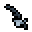
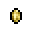
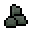
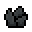
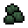

# 世界：物品
在探索世界时，玩家会发现不同的物体进行交互并收集有用的资源。你可以开采岩石来获取[石头](#石头)、[矿石](#矿石)和[矿物](#矿物)，破坏村庄、洞穴和地牢中的各种结构和物体来获取墙壁和门、家具、制作站和其他材料，以及打破[板条箱](#板条箱)、[箱子](#箱子)和其他物体来收集[宝藏](#宝藏)。

## 宝藏
在大多数[迷你生物群落](Mini_Biomes.md)的箱子、板条箱、花瓶、石棺和墓碑中都可以找到**宝藏**。

|
物品
|
掉落物
|
|----|----|
|箱子|弹药 &emsp; 锭 &emsp; 农作物 &emsp; 深水捕集器 &emsp; 附魔卷轴 &emsp; 鱼竿 &emsp; 水果 &emsp; 药水 &emsp; 树苗 &emsp; 种子 &emsp; 饰品 &emsp; 武器|
|金币堆|金币|
|板条箱|弹药 &emsp; 锭 &emsp; 金币 &emsp; 药水 &emsp; 回城卷轴 &emsp; 火把|
|石棺|弹药 &emsp; 锭 &emsp;  &emsp; 鲜血迸发 &emsp; 金币 &emsp; 药水 &emsp; 回城卷轴 &emsp; 火把 &emsp; 附魔卷轴 &emsp; 吸血鬼的馈赠|
|墓碑|弹药 &emsp; 锭 &emsp; 金币 &emsp; 药水 &emsp; 回城卷轴 &emsp; 火把|
|花瓶|弹药 &emsp; 锭 &emsp; 金币 &emsp; 药水 &emsp; 回城卷轴 &emsp; 火把|

## 石头
**岩石**可以在洞穴中找到，也有散落在地表的小岩石。

|
物品
|
掉落物
|
|----|----|
|地表岩石|石头|
|地表砂石|砂石|
|岩石|石头|
|雪地岩石|雪地岩石|
|沼泽岩石|沼泽岩石|
|沙漠岩石|砂石|
|深层岩石|深层岩石|
|深层雪地岩石|深层雪地岩石|
|深层沼泽岩石|深层沼泽岩石|
|深层沙岩|深层砂岩|

## 矿石
**矿石**可以在洞穴和深洞的岩石内找到。通过用矿石开采岩石，您将获得矿石和石头。

|
矿脉
|
石头分布区
|
掉落物
|
|----|----|----|
|铜矿脉|所有石头|铜矿 &emsp; 任何石头|
|铁矿脉|所有石头|铁矿 &emsp; 任何石头|
|金矿脉|所有石头|金矿 &emsp; 任何石头|
|常春藤矿脉|沼泽岩石|常春藤矿 &emsp; 沼泽岩石|
|钨矿脉|所有深层石头|钨矿 &emsp; 任何深层石头|
|冰川矿脉|深层雪地岩石|冰川矿 &emsp; 深层雪地岩石|
|菌丝矿脉深层沼泽岩石|菌丝矿 &emsp; 深层沼泽岩石|
|远古化石矿脉|深层沙漠岩石|远古化石矿 &emsp; 深层砂石|

## 矿物
**矿物**可以在[洞穴](Caves.md)和[深层洞穴](Caves.md#深层森林洞穴)中找到。

|
矿物
|
石头分布区
|
掉落物
|
|----|----|----|
|粘土矿|无|粘土|
|冰霜碎片矿|雪地岩石|冰霜碎片 &emsp; 雪地岩石|
|石英矿|砂石|石英 &emsp; 砂石|
|黑曜石矿|无|黑曜石|
|生命石英矿|任何深层岩石|生命石英 &emsp; 任何深层岩石|

## 板条箱
板条箱会在[洞穴](Caves.md)中生成，也会在[海盗村庄](Pirate_Village.md)中生成。板条箱被摧毁时会掉落各种物品，请参阅[宝藏](#宝藏)获取列表。

## 箱子 
**箱子**是用来存放物品的家具。可以通过单击宝箱名称（位于存储 UI 的左上角）来重命名宝箱，这接受文本和物品图标。（要添加项目图标，请选择名称字段，然后按住 CTRL 键并单击存储中的项目以将图标添加到命名空间）。 
允许玩家自定义他们的存储并通过将鼠标光标悬停在宝箱上来快速查看名称/图标。
### 箱子种类

恶魔宝箱 &emsp; 地牢宝箱 &emsp; 橡木箱子 &emsp;  棕榈木箱子 &emsp;  松木箱子 &emsp;  云杉箱子 &emsp;  枯木宝箱 &emsp;  冷藏箱 &emsp;  焚化炉  

>大部分宝箱可在[木工台]()制作，但地牢宝箱只能在地下城中找到，无法制作。