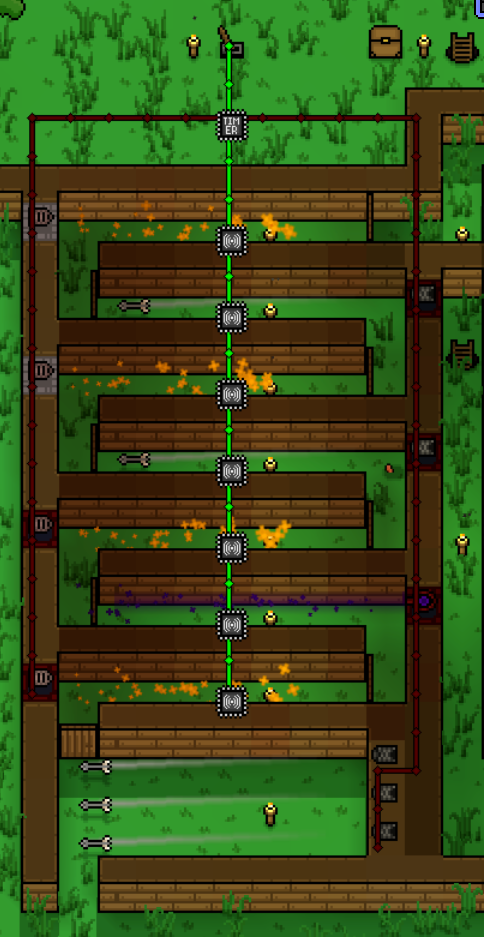

# 入侵

**入侵者**是在[突袭活动](#事件)期间于夜间攻击营地的独特敌人。他们的外观是随机的，并配备有[盔甲]()和[武器]()。 

有几个因素会影响他们的力量水平： 
1. [长老任务](Quests.md)的进展：影响他们对装备的选择，以及与营地的统计数据相匹配（也随着所述进展而变化）。 
2. 玩家在上一次入侵中成功：根据玩家造成的伤害，下一次入侵的入侵者将有伤害倍数，最大 125%（如果入侵者持续失败），最小 50%（如果所有居民死亡）。它只会以很小的增量变化，并在几次袭击后达到最小/最大值。 

黄昏后偶尔会发生入侵事件。如果营地的居民少于3人，则不会发生这种情况。入侵者将从特定方向而来，他们会先聚集并在攻击前进行短暂的准备。你还可以在岛屿地图上看到袭击者，这样你就会知道在哪里防守。 

基于设定中的[入侵频率]()，触发时间在 1.5 到 2.5 小时之间。每次袭击都会将下一个最大冷却时间增加 30 分钟，但上限为 5 小时。 
玩家完成营地的[首领任务](Quests.md#boss任务)后，最大冷却时间将减少 30 分钟，但永远不会低于基础 2.5 小时。 

 
*入侵即将发生的警告*

入侵者会分批而来，每一波都会由几个小团体组成。入侵者的总数取决于他们正在攻击的营地中居民的数量。最少为 20 名入侵者，没有上限（例如，如果有 15 名居民，则有 53 名入侵者）。入侵者将向的中心和居民占据的房屋移动。居民通常晚上呆在自己的房间里，但当入侵者接近他们的房间时，他们就会出来与他们战斗。当居民失去大约一半的生命值时，他们将退回自己的房间进行治疗。 

如果没有其他居民分散入侵者的注意力，他们将前往最近的有人居住的房间，**破门而入**并攻击里面的定居者，直到他们或居民死亡。如果居民被杀，入侵将继续前往定居点的中心，攻击他们在途中发现的任何居民。所以你拥有的居民越多，他们在离开之前就会试图杀死越多的人。确切的数字取决于难度。 

杀死入侵者会掉落随机数量的[金币]()，有时还会掉落他们的[武器]或部分[盔甲]()。 
入侵者的攻击将持续下去，直到弹出入侵者要离开的消息。他们会逃到该区域的边缘并消失，即使当时正在战斗。 
如果居民在袭击中死亡，他们**不会**重生，但同一类型的定居者很有可能在被招募后不久到达。 

**用墙围住自己的领地是没有用的。如果找不到办法，掠夺者就会破墙而入！** 

## 防御入侵

在许多战术中，陷阱可用于防御袭击，例如入侵者的[杀戮迷宫](#杀戮迷宫)。您还可以通过单击**打开营地**按钮（默认为 C），然后单击**命令**，然后选择一个或多个居民（通过拖动矩形或左键单击其中一个），然后**跟随我**，然后分组来控制您的居民。 

为了确保您的居民生存，请为他们配备比较好的盔甲和武器。 

## 事件

**事件**是游戏中偶尔发生的事件。目前唯一的敌对事件是袭击事件。发生在玩家营地的夜间，出现频率详情请参阅[入侵](#入侵)。 
随着新活动的实施，这些活动的时间和地点可能与入侵事件不同。 
NPC 将偶尔也会到达玩家的营地。 

### 杀戮迷宫

**创新是第一生产力，请自由设计属于你的迷宫** 
这个概念验证是一个简单的[接线](Wiring.md)示例。有关其他示例，请参阅接线示例。这个杀戮迷宫的目的是防御入侵者。 

#### 说明
该迷宫于 2023 年 5 月 14 日在 0.21.29 版本上进行了测试，显然从该版本开始它仍然有效。请注意，杀戮迷宫提供了门，可以引导袭击者穿过迷宫，这样他们就不会破坏定居点的墙。 
本页的大部分内容是关于探索杀戮迷宫的概念。有关杀戮迷宫的实际示例，请阅读本节。注2：截至2023年5月16日，已确认如果寻路距离他们的位置太远，袭击者将攻击墙壁（假设摧毁墙壁比穿过门更快）。 

#### 营地城墙
在这个例子中，围绕整个营地建造了一堵矩形墙，而杀戮迷宫则靠着南墙建造。 

1. 杀戮迷宫是定居点墙上唯一的开口，因此无论掠夺者或 NPC 来自哪个方向，他们都应该能够到达杀戮迷宫并通过它进入和离开定居点。 
   请注意，杀戮迷宫为袭击者（和其他 NPC）提供了进入定居点的入口，这可以防止他们打破定居点墙壁。 
2. 然而，有时他们将无法找到路径，并会被困在定居点墙的侧面或角落。 
3. 当派遣钓鱼者和探险家外出旅行以及流浪的 NPC 来访时，可能会发生这种情况。 
4. 营地墙不应该比矩形更复杂，以方便掠夺者和 NPC 到达南侧的杀戮迷宫。 
   请注意，NPC 房间靠近杀戮迷宫。 
5. 由于袭击者的目标是沉睡的 NPC，这可以让他们更容易找到南部的开口。不过，房间太偏东了。这将导致一小部分袭击者需要别的方法来击杀。   

#### 杀戮迷宫
这是杀戮迷宫的特写。 

 

1. 仅使用该迷宫的左侧三分之一。其他部分是不必要的，并且会使袭击者和 NPC 的寻路变得更加困难。 
2. NPC 可以穿过门，因此他们应该可以毫无困难地穿过迷宫。 
3. 然而，袭击者会被困在每扇门上。因此，每扇门都代表着一个“杀戮箱”，袭击者在打开门时会不断受到伤害。 

#### 入侵者路径
这是突袭者（和徘徊的 NPC）进入定居点时所走的路径。 

 

1. 袭击者从南边进入。每扇门代表一个杀戮箱。当他们穿过第一道门后，真正的陷阱开始了。 
2. [火焰陷阱]()和[虚空陷阱]()应该首先放置。它们会对敌人造成最大伤害，因为每次激活会伤害多个敌人。箭陷阱每次激活只会伤害单个敌人。 
3. 玩家不应该进入被困区域，但如果他们拥有像疏浚法杖这样可以穿过墙壁的武器，他们就可以安全地对正在打开每扇门的敌人造成额外伤害。 
4. 图中看到的梯子可以让玩家通过下面的洞穴轻松绕过墙壁。有时，当袭击者最终穿过一扇门时，他们会把门开着。 
5. 如果玩家距离足够近，玩家可以关上门，迫使后来的袭击者再次卡在同一扇门上。 
6. 有时，当袭击者打开一扇门并将其保持打开状态时，“打开”的位置也会阻碍他们的前进，进一步减慢他们的速度，这将取决于门的方向。 
7. 如果袭击者看起来会一路穿过迷宫，玩家可以堵塞定居点墙上的开口，导致袭击者被阻塞或试图离开迷宫，从而受到进一步伤害。 

#### 感受器和计时器的设置

 

1. 所有传感器都具有相同的设置。 
2. 所有传感器都连接在一起。这可能是传感器太多了。 
3. 并非所有这些传感器都是必需的。传感器仅在检测到敌对生物时才会激活。当它们激活时，绿线会激活计时器门。 
4. 在此示例中，传感器范围设置为 4。 

 

计时器门由绿线激活，并由红线激活陷阱。 
  
 

#### 测试拉杆
[拉杆]()用于手动控制陷阱的操作。 
 

#### 升级版杀戮迷宫
下面制作了一个新版本的杀戮迷宫，并将其放置在定居点墙的东南角。该副本被放置在西北角。旧的杀戮迷宫被移除。 
1. 请注意，杀戮迷宫位于定居点墙内。 
2. 请注意，杀戮迷宫在定居点墙上提供了一个开口，供掠夺者（和其他 NPC）通过。这可以防止袭击者破坏定居点围墙。 
  
#### 感受器和计时器设置

 
与之前的设置相同，只是传感器范围已减少到 2。 

 
和之前设置相同。 

 
使用拉杆操作。 

#### 使用升级版杀戮迷宫的营地

 

